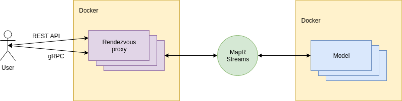
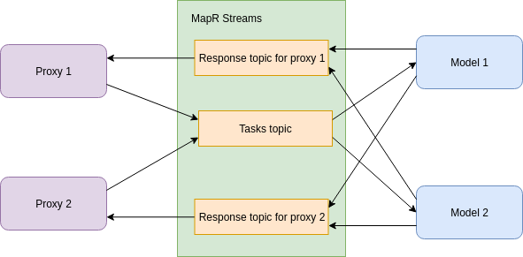

# Rendezvous
System consist of 2 modules:
* Proxy
* Model

## Architecture


## Components
### Proxy
Proxy receives requests from user over REST or gRPC. 
Then it sends requests over MapR Streams to models and waits for responses. 
When responses are coming we look if they are from primary/requested model or not, 
if we have not received response from primary/requested model in timeout, than we will choose response from model, 
which have more accuracy.

### Model
After configuration model subscribes for task's topic in MapR Streams. 
When model receives request it slips some time for emulating computing and sends result to result topic in MapR Streams.

### Communication between components

## API
### REST
To send task you have to make a PUT request to http://ADDRESS:PORT/task with JSON: or via GRPC ADDRESS:PORT
(default ports are 8080 for REST and 50051 for GRPC)
```json
{
  "timeout": 10000,
  "modelId": "MODEL_ID",
  "modelClass": "MODEL_CLASS"
}
```
* timeout - time in milliseconds for waiting for response from models (by default 30000)
* modelId - id of model from which you want to get response
* modelClass - class of models from which you want to get response

All this fields are optional. And you can send just blank JSON to use default values.

If everything is ok, then you will receive the next response:
```json
{
  "requestId": "ID_OF_REQUEST",
  "modelId": "MODEL_ID",
  "modelClass": "MODEL_CLASS",
  "result": "SOME_RESULT",
  "accuracy": 0.1
}
```
* requestId - id of request
* modelId - id of model
* modelClass - class of model
* result - some result
* accuracy - accuracy of result

## Quick start
1. Clone repository
2. Build containers with required user, group, UID and GID
    ```bash
        ./gradlew buildImage -P MAPR_CONTAINER_USER=YourUser -P MAPR_CONTAINER_UID=YourUID -P MAPR_CONTAINER_GROUP=YourGroup -P MAPR_CONTAINER_GID=YourGID
    ```
3. Set properties for connection in `docker/connection.env`
    * MAPR_CLUSTER - cluster's name
    * MAPR_CLDB_HOSTS - CLDB hosts
    * MAPR_ZOOKEEPER_HOST - Zookeeper hosts
    * KAFKA_STREAM - path to MapR stream
4. Start docker compose
    ```bash
        ./gradlew composeUp
    ```
5. Make REST or GRPC request

## Advanced containers settings
If it is necessary you can specify additional properties in `docker/docker-compose.yml`:

### Proxy
* CONFIG_PROXY_ID - id of proxy, otherwise will be default
* CONFIG_DEFAULT_TIMEOUT - default timeout for waiting model responses in milliseconds
* MODEL_PRIMARY - id of primary model
### Model
* CONFIG_ID - model's id
* CONFIG_ACCURACY - model;s accuracy
* CONFIG_MODEL_CLASS - model's class
* CONFIG_SLEEP_START - start of interval for generating random sleep in milliseconds
* CONFIG_SLEEP_END - end of interval for generating random sleep in milliseconds
* CONFIG_RESULT_START - start of interval for generating random result
* CONFIG_RESULT_END - end of interval for generating random result